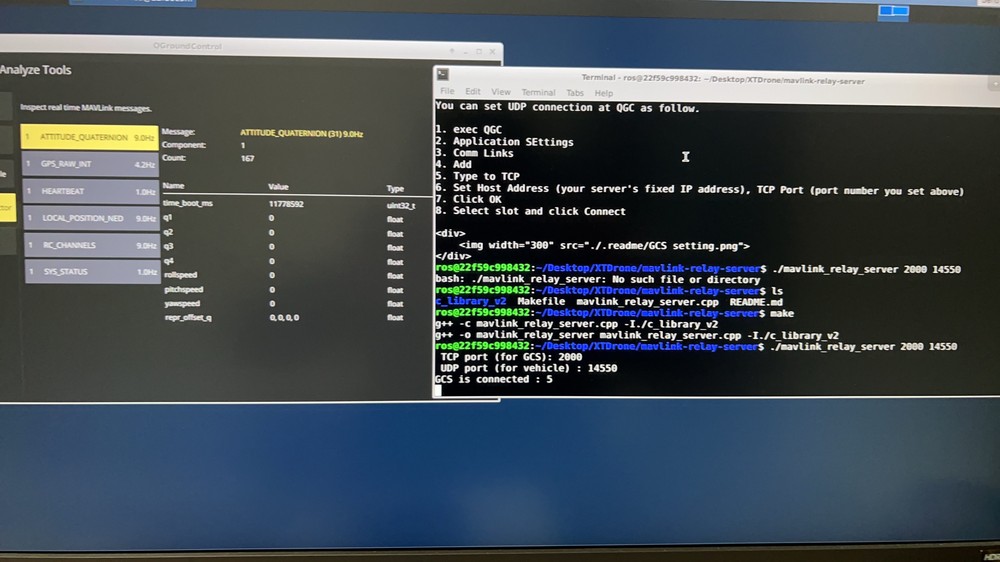

# Access QGroundControl with marvlink broker

## Overview
* Run mavlink broker on GCS host
* Setup mavlink service on UAVs 
  * Run up mavlink-router to rout mavlink message to GSC host from UAVs
  
  or

  * Run up mavros to forward mavlink to GSC host
  
* Run QGC to connect local port which broker forward to

## Run up Broker
First, go to this folder. And then,

    make
    ./mavlink_relay_server {TCP_PORT=20250} {UDP_PORT=20200}

TCP and UDP is used for connecting GCSs and vehicles relatively.

**argument examples:**

TCP_PORT = 20250 (default), UDP_PORT = 20200 (default)

    ./mavlink_relay_server

TCP_PORT = 20000, UDP_PORT = 20200 (default)

    ./mavlink_relay_server 20000

TCP_PORT = 20000, UDP_PORT = 19000

    ./mavlink_relay_server 20000 19000

### Run up marvlink router on UVAs

Please see the output of `mavlink-routerd --help` for the full list of command
line options. The most important facts are:

- The TCP server is enabled by default
- TCP and UDP endpoints can be added multiple times
- UDP endpoints added with the `-e` option are started in `normal` mode
  (sending data to the specified address and port)
- The last parameter (without a key) can either be one UART device or an UDP
  connection. This UDP endpoint will be started in `server` mode (waiting for
  an incoming connection)!
To route mavlink packets from UART `ttyUSB0` to 2 other UDP endpoints, use the
following command:

    $ mavlink-routerd -e {GCS_IP}:14550 -e 127.0.0.1:14550 /dev/ttyUSB0:115200

The `115200` after the colon in `/dev/ttyUSB0:115200` sets the UART baudrate.
See more options with `mavlink-routerd --help`.

### Run up mavros router on UVAs

And mavros is used on UAVs that install LTE dongle for send packet to server.

    roslaunch mavros px4.launch fcu_url:="udp://:14540@{your server's IP}:{your server's UDP port}"
    roslaunch mavros px4.launch fcu_url:="/dev/ttyUSB0:115200" gcs_url:="{your server's IP}:{your server's UDP port}"

## Run QGC to connect port which broker forward to

You can set UDP connection at QGC as follow.

1. exec QGC
2. Application SEttings
3. Comm Links
4. Add
5. Type to TCP
6. Set Host Address (your server's fixed IP address), TCP Port (port number you set above)
7. Click OK
8. Select slot and click Connect

    

