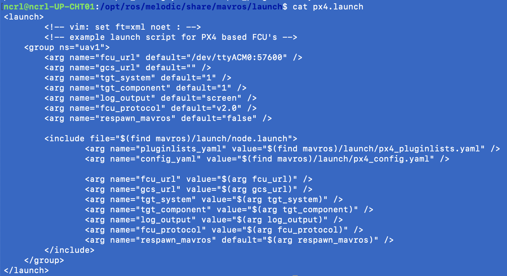

# Running MAVROS across multiple machines

<div>
    
</div>


## Overview
* Setup VPN and then connect GSC and all UAV on.

  Note: Maybe a kernel space VPN server like OpenVPN and Wireguard are free choises. https://www.snbforums.com/threads/disabling-openvpn-encryption-auth-completely.57177/. Or charged VPN service https://www.cyberciti.biz/faq/ubuntu-20-04-set-up-wireguard-vpn-server/, if need more performance. 

* All UAV must be configured to use the same GSC as master, via ROS_MASTER_URI.

* There must be complete, bi-directional connectivity between all pairs of machines, on all ports (see [ROS/NetworkSetup](http://wiki.ros.org/ROS/NetworkSetup)).

* Each machine must advertise itself by a name that all other machines can resolve (see [ROS/NetworkSetup](http://wiki.ros.org/ROS/NetworkSetup)).

* (Optional) Add custom messages on MAVROS, please refer https://docs.px4.io/master/en/ros/mavros_custom_messages.html

## Setup

### VPN
Here is the sample for OpenVPN as Client.

```shell
# Install OpenVPN Client https://openvpn.net/cloud-docs/openvpn-3-client-for-linux/
sudo apt install apt-transport-https
sudo wget https://swupdate.openvpn.net/repos/openvpn-repo-pkg-key.pub
sudo apt-key add openvpn-repo-pkg-key.pub
sudo wget -O /etc/apt/sources.list.d/openvpn3.list https://swupdate.openvpn.net/community/openvpn3/repos/openvpn3-$DISTRO.list # bionic
sudo apt update
sudo apt install openvpn3

# Connect OpenVPN Server

openvpn3 session-start --config ${CONFIGURATION_FILE}

```

### Name resolution
When a ROS node advertises a topic, it provides a hostname:port combination (a URI) that other nodes will contact when they want to subscribe to that topic.
It is important that the hostname that a node provides can be used by all other nodes to contact it. The ROS client libraries use the name that the machine reports to be its hostname.
This is the name that is returned by the command hostname.

If a machine reports a hostname that is not addressable by other machines, then you need to set either the ROS_IP or ROS_HOSTNAME environment variables.

#### Example
Continuing the example of gcs and uav1, say we want to bring in a third machine. The new machine, named uav2, uses a VPN address, say 10.0.0.3, and other machines cannot resolve the hostname uav2 into an IP address (this should not happen on a properly configured DHCP-managed network, but it is a common problem).

In this situation, neither gcs nor uav1 are able to ping uav2 by name, and so they would not be able to contact nodes that advertise themselves as running on uav2. The fix is to set ROS_IP in the environment before starting a node on uav2:
```shell
ssh 10.0.0.3 # We can't ssh to uav2 by name
export ROS_IP=10.0.0.3 # Correct the fact that uav2's VPN address can't be resolved
export ROS_MASTER_URI=http://10.0.0.1:11311
<start a node here>
```
A similar problem can occur if a machine's name is resolvable, but the machine doesn't know its own name. Say uav2 can be properly resolved into 10.0.0.3, but running hostname on uav2 returns localhost. Then you should set ROS_HOSTNAME:
```shell
ssh uav2 # We can ssh to uav2 by name
export ROS_IP=10.0.0.3 # Correct the fact that uav2's VPN address can't be resolved
export ROS_HOSTNAME=uav2 # Correct the fact that uav2 doesn't know its name
export ROS_MASTER_URI=http://10.0.0.1:11311
<start a node here>add prefix in mavros
```
<div>
    
</div>

### Configuring /etc/hosts
Another option is to add entries to your /etc/hosts file so that the machines can find each other. The hosts file tells each machine how to convert specific names into an IP address.

Following is a sample /etc/hosts file:
```shell
           IPAddress    Hostname
           127.0.0.1	localhost
           10.0.0.1		gcs 
           10.0.0.2		uav1
           10.0.0.3		uav2
```

### (Optional)Add prefix of topic for multiple nodes in mavros

Because all UAVs need to communicate with GCS, we need to run mavros up for each UVAs. But we should set a unique mavros group name for each UAVs.
Open the px4.launch, and then add <group ns="{GROUP_NAME}">...</group>
    
    $ roscd mavros/launch

```xml
<?xml version="1.0"?>
<launch>
    <!-- Posix SITL PX4 launch script -->
    <!-- Launches Only PX4 SITL. This can be used by external projects -->
    <group ns="uav1">
        <!-- PX4 config arguments -->
        <arg name="est" default="ekf2"/>
        <arg name="vehicle" default="iris"/>
        <arg name="ID" default="0"/>
        <arg name="interactive" default="true"/>

        <env name="PX4_SIM_MODEL" value="$(arg vehicle)" />
        <env name="PX4_ESTIMATOR" value="$(arg est)" />
        <arg unless="$(arg interactive)" name="px4_command_arg1" value="-d"/>
        <arg     if="$(arg interactive)" name="px4_command_arg1" value=""/>
        <node name="sitl_$(arg ID)" pkg="px4" type="px4" output="screen" args="$(find px4)/build/px4_sitl_default/etc -s etc/init.d-posix/rcS -i $(arg ID) $(arg px4_command_arg1)">
        </node>
    </group>
</launch>
```

<div>
    
</div>
Let's run mavros up!

On GCP MASTER Node:

    $ roscore
<div>
    
</div>

On UAV Nodes:

    $ roslaunch mavros px4.launch fcu_url:=/dev/ttyUSB0:115200 mavros_ns:=uav1 tgt_system:=1
    $ # Or, controled by QGC at the same time.
    $ roslaunch mavros px4.launch fcu_url:=/dev/ttyUSB0:115200 gcs_url:=udp://:14556@{QGC_IP}:14550

<div>
    
    
</div>

Check with *rostopic list* on MASTER Node:

<div>
    
    
</div>

### Appendix
    
    * Monitoring STATUS FOR MASTER CONNECTION: https://answers.ros.org/question/202369/how-to-handle-disconnectionreconnection-to-the-ros-master/


