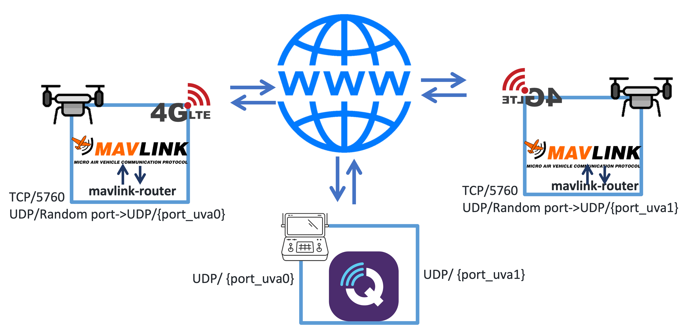
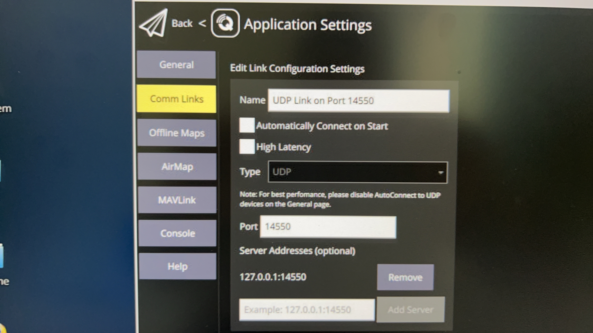
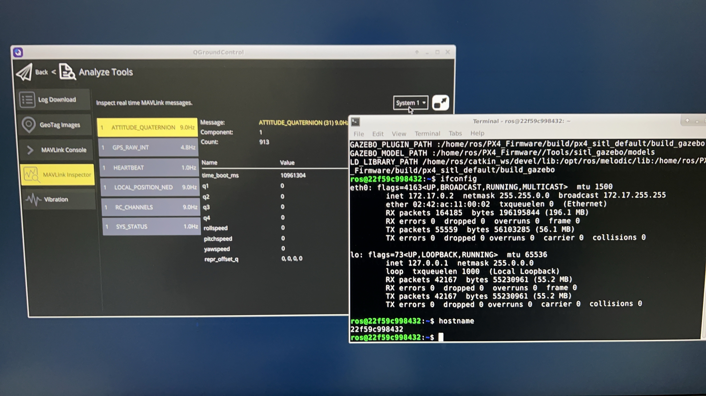

# Access QGroundControl with marvlink

## Overview
* Run up mavlink-router to rout mavlink message to GSC host from UAVs
* Run QGC on GCS host to connect local port which UAVs send to

    

## Install mavlink router
[mavlink-router official repo](https://github.com/mavlink-router/mavlink-router#cli-parameters)

### Compilation and Installation

In order to compile you need the following packages:

- GCC or Clang compiler
- meson >= 0.57 and ninja-build
- C and C++ standard libraries

### Fetch dependencies

We currently depend on the mavlink C library. The corresponding submodule
should be fetched:

    $ git submodule update --init --recursive

We need some additional packages as build dependencies. Packages for some
distros:

Debian/Ubuntu:

    $ sudo apt install git meson ninja-build pkg-config gcc g++ systemd
Note that meson package must be version 0.55 or later. If your package manager
does not have this version, a more recent version can be downloaded via pip:

    $ sudo pip3 install meson

If using this method, meson must _not_ be installed with ``--user``.

### Build

The build system follows the usual configure/build/install cycle.
Configuration is needed to be done only once.

A typical configuration for a x86-64 system is shown below:

    $ meson setup build .

### CLI Parameters

Please see the output of `mavlink-routerd --help` for the full list of command
line options. The most important facts are:

- The TCP server is enabled by default
- TCP and UDP endpoints can be added multiple times
- UDP endpoints added with the `-e` option are started in `normal` mode
  (sending data to the specified address and port)
- The last parameter (without a key) can either be one UART device or an UDP
  connection. This UDP endpoint will be started in `server` mode (waiting for
  an incoming connection)!
To route mavlink packets from UART `ttyUSB0` to 2 other UDP endpoints, use the
following command:

    $ mavlink-routerd -e {GCS_IP}:14550 -e 127.0.0.1:14550 /dev/ttyUSB0:115200

The `115200` after the colon in `/dev/ttyUSB0:1500000` sets the UART baudrate.
See more options with `mavlink-routerd --help`.

## Run QGC to connect local port

    
    

