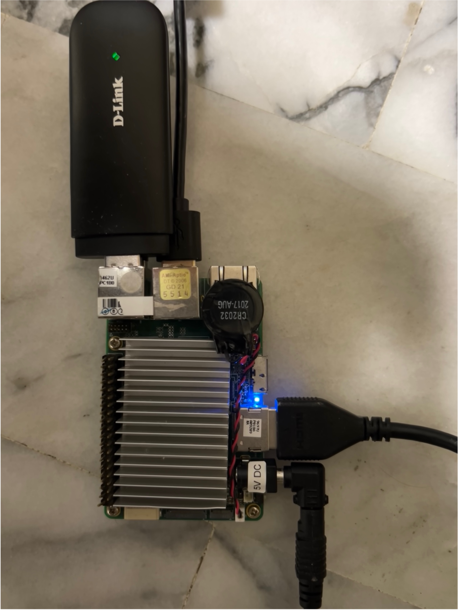
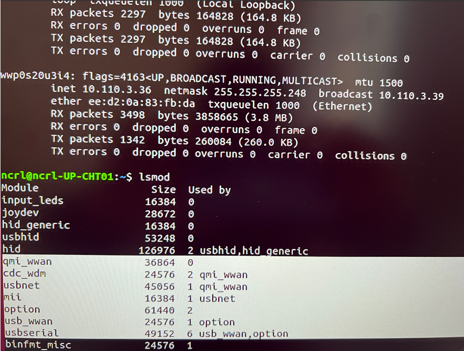

# Hookup 4G/LTE Dongle

## Guide

An example using D-Link DWM-222.

Fist, plugging into usb port on the dongle. And then reboot the host.
If the driver is set, you can see Mobile Setting on Network Panel.

 
    
    
    
    
    
    
    
    
    
    

If the driver is not set. It need to install "usb-modeswitch" then reboot.

    $ sudo apt-get update -y
    $ sudo apt-get install -y usb-modeswitch
    $ sudo modprobe qmi_wwan
    $ sudo modprobe option
    $ reboot

